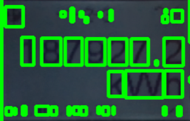

## Recognizing digits on a meter

## Generating your own data

Basically you need to crop images of digits, and process it into mnist format.
I used the data set from [Street View House Numbers](http://ufldl.stanford.edu/housenumbers/train.tar.gz) , cropped the digits using the specified bounding boxes, converted them into gray scale. Download the tar, untar it, and you'll have  `digitStruct.mat` which contains the metadata for each photo in that training set.

```
python digitStruct.py -i train/digitStruct.mat -o myDigitsFolder
python generateYourOwnData/convert-images-to-mnist-format.py --trainFolder myDigitsFolder 
```

## Training the classifier

```
python generateClassifier.py --images_file train-images-idx3-ubyte-73228.gz --labels_file train-labels-idx1-ubyte-73228.gz --num_images 73228 --output_file digits_cls_svhn_nobw.pkl 
```

## Predicting
You have to tune the parameters to get reasonable predictions. You can use `vary-threshold.py` and `vary-gradients.py` to get a sense of how the values affect the picture.

The hardest part is finding the correct bounding boxes. I assume that the digits in a meter will be horizontally aligned next to each other, so I look for rows of boxes (with increasing left position,  approximately same bottom position,  approximately same height,  approximately same width.)
Set a value for the argument `-t` to keep or discard the pixels with values above this value, depending on whether you chose to set `-r` for inversion,  `-b` for the minimum area in a box, `-o` for a tolerance level in height/bottom differences between boxes of different digits, and `-d` for the minimum number of digits to be found. 


` python performRecognition.py -i photos/gt.jpg -v -r -t 45 -b 100 -o 3 `


` ('Predictions: ', [1, 8, 7, 9, 2, 7, 2]) `

` python performRecognition.py -i photos/home.jpg -v -t 82 -b 0 -o 10 `


` ('Predictions: ', [2, 5, 3, 3, 1]) ` 


## Process





### Regions of interest


